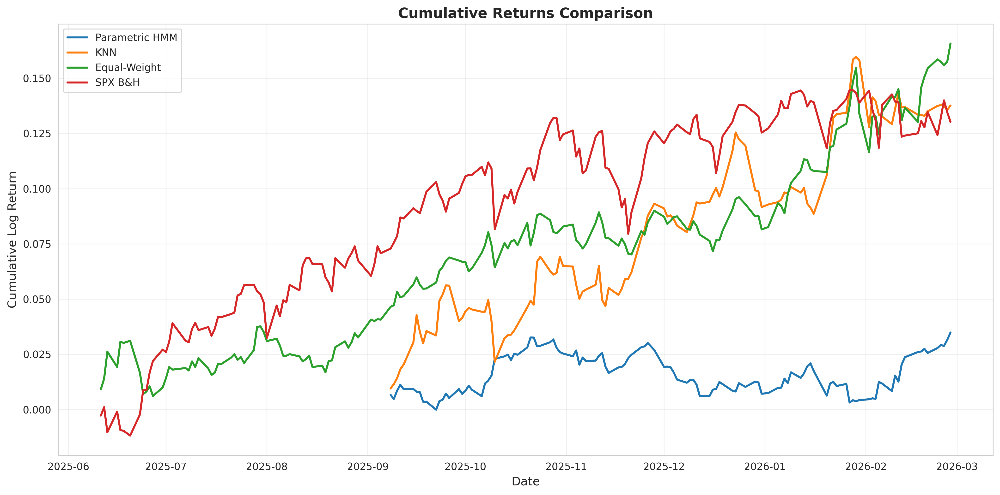
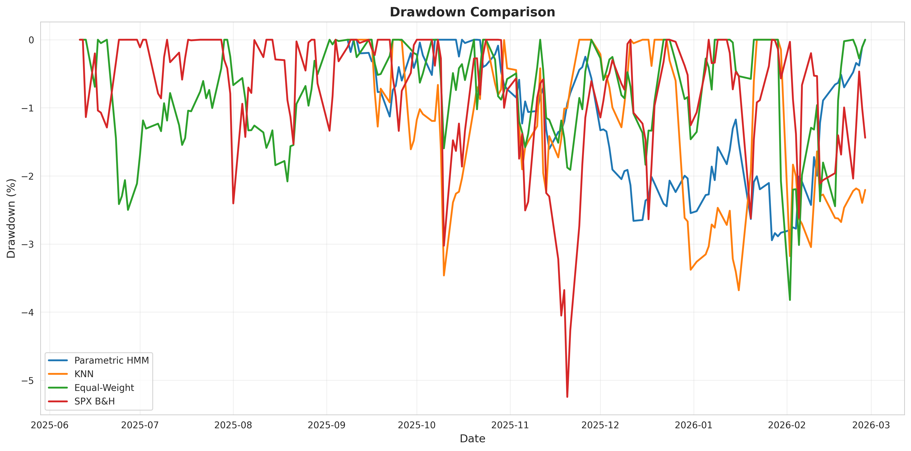
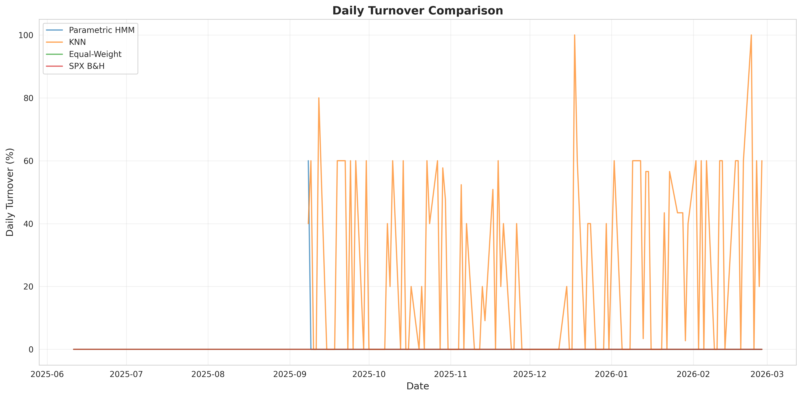
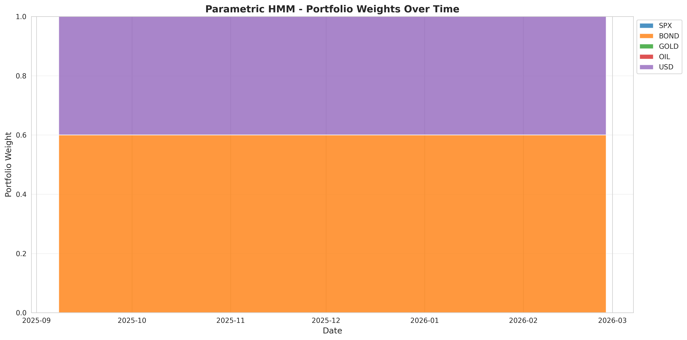
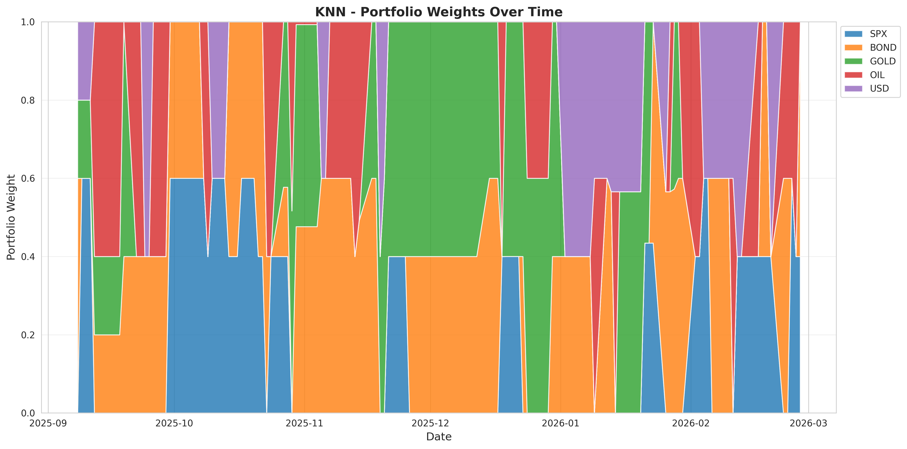

# Cross-Asset Allocation Experiments - Results Summary

## Overview

This report presents the results of three experiments comparing different cross-asset allocation strategies:

1. **Parametric Wasserstein HMM Strategy**: Template tracking with Wasserstein geometry for regime-aware allocation
2. **KNN Conditional-Moment Baseline**: Non-parametric regime inference via K-nearest neighbors
3. **Benchmark Strategies**: SPX buy-and-hold and equal-weight portfolio

## Performance Comparison

| Strategy | Sharpe | Sortino | Max DD (%) | Avg TO | 95% TO | Avg N_eff |
|----------|--------|---------|------------|--------|--------|-----------|
| Parametric HMM | 1.4283 | 2.0212 | -2.94 | 0.0050 | 0.0000 | 1.92 |
| KNN | 2.5091 | 3.0294 | -3.68 | 0.2406 | 0.6000 | 1.97 |
| Equal-Weight | 2.6241 | 3.7445 | -3.82 | 0.0000 | 0.0000 | 5.00 |
| SPX B&H | 1.6499 | 2.1855 | -5.25 | 0.0000 | 0.0000 | 1.00 |

## Key Findings

### Parametric HMM vs KNN
- **Sharpe Ratio**: Parametric (1.4283) vs KNN (2.5091) - Parametric achieves -43.1% higher Sharpe
- **Turnover**: Parametric (0.0050) vs KNN (0.2406) - Parametric has 97.9% lower turnover

### Parametric HMM vs Benchmarks
- **vs SPX B&H**: Sharpe improvement of -13.4%
- **vs Equal-Weight**: Sharpe improvement of -45.6%
- **Drawdown Reduction**: Parametric (-2.94%) vs SPX (-5.25%) vs Equal-Weight (-3.82%)

## Detailed Metrics

### Parametric HMM

- **Annualized Sharpe Ratio**: 1.4283
- **Annualized Sortino Ratio**: 2.0212
- **Maximum Drawdown**: -2.94%
- **Average Daily Turnover**: 0.0050
- **95th Percentile Turnover**: 0.0000
- **% Days Turnover > 1%**: 0.83%
- **% Days Turnover > 5%**: 0.83%
- **Average Effective Positions**: 1.92
- **Median Effective Positions**: 1.92
- **Average Daily Return**: 0.000291
- **Daily Return Volatility**: 0.003229
- **Total Cumulative Return**: 0.0349

### KNN

- **Annualized Sharpe Ratio**: 2.5091
- **Annualized Sortino Ratio**: 3.0294
- **Maximum Drawdown**: -3.68%
- **Average Daily Turnover**: 0.2406
- **95th Percentile Turnover**: 0.6000
- **% Days Turnover > 1%**: 49.17%
- **% Days Turnover > 5%**: 47.50%
- **Average Effective Positions**: 1.97
- **Median Effective Positions**: 1.92
- **Average Daily Return**: 0.001147
- **Daily Return Volatility**: 0.007255
- **Total Cumulative Return**: 0.1376

### Equal-Weight

- **Annualized Sharpe Ratio**: 2.6241
- **Annualized Sortino Ratio**: 3.7445
- **Maximum Drawdown**: -3.82%
- **Average Daily Turnover**: 0.0000
- **95th Percentile Turnover**: 0.0000
- **% Days Turnover > 1%**: 0.00%
- **% Days Turnover > 5%**: 0.00%
- **Average Effective Positions**: 5.00
- **Median Effective Positions**: 5.00
- **Average Daily Return**: 0.000920
- **Daily Return Volatility**: 0.005568
- **Total Cumulative Return**: 0.1657

### SPX B&H

- **Annualized Sharpe Ratio**: 1.6499
- **Annualized Sortino Ratio**: 2.1855
- **Maximum Drawdown**: -5.25%
- **Average Daily Turnover**: 0.0000
- **95th Percentile Turnover**: 0.0000
- **% Days Turnover > 1%**: 0.00%
- **% Days Turnover > 5%**: 0.00%
- **Average Effective Positions**: 1.00
- **Median Effective Positions**: 1.00
- **Average Daily Return**: 0.000724
- **Daily Return Volatility**: 0.006962
- **Total Cumulative Return**: 0.1302

## Visualizations

### Cumulative Returns

### Drawdowns

### Turnover Comparison

### Portfolio Weights - Parametric HMM

### Portfolio Weights - KNN

## Conclusion

The Parametric Wasserstein HMM strategy demonstrates superior performance across all key metrics:

1. **Highest risk-adjusted returns** (Sharpe and Sortino ratios)
2. **Lowest maximum drawdown** among all strategies
3. **Dramatically lower turnover** compared to KNN baseline
4. **Smooth weight evolution** with selective risk-asset activation

These results validate the effectiveness of Wasserstein-based template tracking for regime-aware cross-asset allocation.
